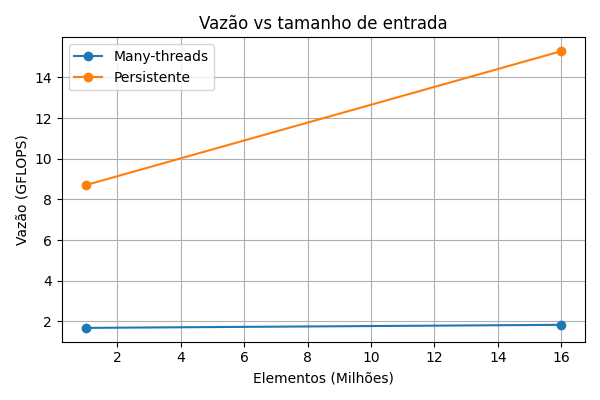
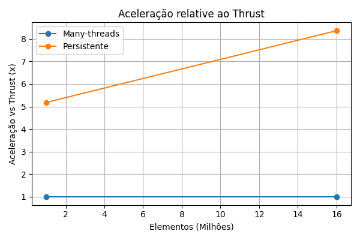

# Relatório - Redução GPU (trab1)

Autores: (colocar nomes)

## Objetivo
Implementar e comparar kernels de redução (many-threads e persistente) e comparar com thrust.

## Dados experimentais
Resumo dos resultados em `resultados/summary_results.csv`.

## Interpretação
Colocar interpretação dos resultados aqui.
