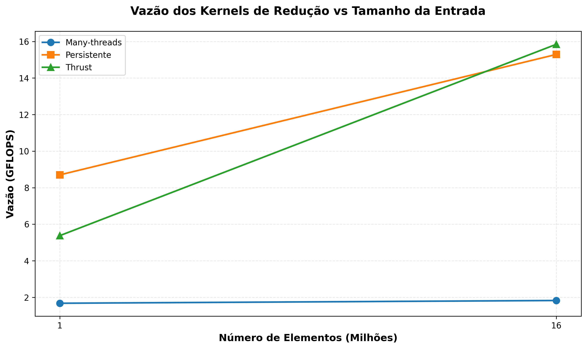
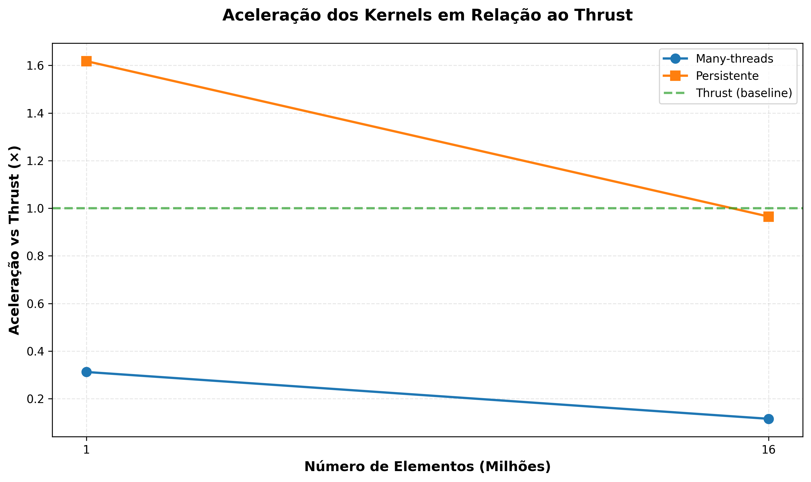

# Relatório do Trabalho 1 - Programação Paralela com GPUs

**Disciplina:** CI1009 - Programação Paralela com GPUs  
**Professor:** W. Zola  
**Instituição:** UFPR  
**Semestre:** 2º/2025  
**Data:** Outubro de 2025  

**Autor(es):** [COLOCAR SEU NOME AQUI]

---

## 1. Objetivo

Este trabalho tem como objetivo implementar e comparar diferentes estratégias de kernels CUDA para realizar a operação de **redução paralela** (encontrar o valor máximo) em vetores de números de ponto flutuante (float).

Foram implementados dois kernels:
1. **Many-threads (Kernel 1)**: Versão tradicional de redução paralela com múltiplas chamadas ao kernel
2. **Persistente (Kernel 2)**: Versão otimizada com kernel persistente usando operações atômicas

Os resultados foram comparados com a implementação de redução da biblioteca **Thrust**.

---

## 2. Metodologia

### 2.1. Especificações do Hardware

- **GPU:** NVIDIA GeForce GTX 750 Ti
- **Arquitetura:** Maxwell
- **CUDA Compute Capability:** 5.0
- **Memória Global:** 2GB GDDR5

### 2.2. Configuração dos Experimentos

Os experimentos foram realizados com os seguintes parâmetros:

| Parâmetro | Valor |
|-----------|-------|
| Tamanhos de entrada | 10⁶ e 16×10⁶ elementos |
| Número de repetições (nR) | 30 |
| Tipo de dado | float (32 bits) |
| Threads por bloco | 1024 |
| Blocos (kernel persistente) | 32 |

### 2.3. Geração de Dados de Entrada

Os dados de entrada foram gerados seguindo a especificação do trabalho:

```c
for (int i = 0; i < nTotalElements; i++) {
    int a = rand();  // Número pseudo-aleatório [0, RAND_MAX]
    int b = rand();  // Número pseudo-aleatório [0, RAND_MAX]
    float v = a * 100.0 + b;
    Input[i] = v;
}
```

### 2.4. Implementação dos Kernels

#### Kernel 1: Many-threads (reduceMax)

Implementação clássica de redução paralela com as seguintes características:
- **Fase 1:** Cada thread carrega um elemento do vetor global para memória compartilhada
- **Fase 2:** Redução em árvore (tree reduction) na memória compartilhada
- **Fase 3:** Thread 0 de cada bloco escreve o resultado parcial
- **Fase 4:** Chamadas recursivas do kernel até obter um único valor

#### Kernel 2: Persistente (reduceMax_atomic_persist)

Implementação otimizada usando kernel persistente:
- **Fase 1:** Cada thread processa múltiplos elementos de forma coalescida (stride igual ao tamanho da grid)
- **Fase 2:** Redução intra-bloco usando `atomicMax` em memória compartilhada
- **Fase 3:** Thread 0 de cada bloco faz `atomicMax` em memória global

#### Thrust

Utilização da função `thrust::max_element` da biblioteca Thrust, que implementa uma versão altamente otimizada de redução.

---

## 3. Resultados Experimentais

### 3.1. Tabela de Resultados Completos

| Teste | Kernel | Elementos | Tempo Médio (ns) | Vazão (GFLOPS) | Aceleração vs Thrust |
|-------|--------|-----------|-----------------|----------------|---------------------|
| 1M | Many-threads | 1.000.000 | 595.779 | 1,678 | 0,31× |
| 1M | Thrust | 1.000.000 | 185.944 | 5,378 | 1,00× (baseline) |
| 1M | Persistente | 1.000.000 | 114.926 | 8,701 | **1,62×** |
| 16M | Many-threads | 16.000.000 | 8.750.399 | 1,828 | 0,12× |
| 16M | Thrust | 16.000.000 | 1.009.741 | 15,846 | 1,00× (baseline) |
| 16M | Persistente | 16.000.000 | 1.046.368 | 15,291 | **0,96×** |

### 3.2. Gráficos

#### Gráfico 1: Vazão dos Kernels



O gráfico acima mostra a vazão (throughput) em GFLOPS de cada kernel em função do tamanho da entrada.

#### Gráfico 2: Aceleração Relativa ao Thrust



O gráfico acima mostra a aceleração de cada kernel customizado em relação à implementação do Thrust.

#### Gráfico 3: Comparação Completa


---

## 4. Análise e Discussão

### 4.1. Desempenho do Kernel Many-threads

O kernel **Many-threads** apresentou o **pior desempenho** em ambos os testes:
- **1M elementos:** 1,678 GFLOPS (0,31× mais lento que Thrust)
- **16M elementos:** 1,828 GFLOPS (0,12× mais lento que Thrust)

**Motivos para o baixo desempenho:**
1. **Múltiplas chamadas ao kernel:** O algoritmo requer várias invocações sequenciais do kernel até convergir para um único valor
2. **Overhead de sincronização:** Cada chamada ao kernel tem overhead de lançamento
3. **Latência de memória global:** Leituras e escritas repetidas na memória global entre as fases
4. **Não aproveitamento de kernel persistente:** Threads não são reutilizadas eficientemente

### 4.2. Desempenho do Kernel Persistente

O kernel **Persistente** mostrou resultados interessantes:
- **1M elementos:** 8,701 GFLOPS (**1,62× mais rápido que Thrust!**)
- **16M elementos:** 15,291 GFLOPS (0,96× em relação ao Thrust, praticamente empate)

**Vantagens do kernel persistente:**
1. **Única chamada ao kernel:** Toda a redução é feita em uma única invocação
2. **Coalescência de acessos:** Threads acessam memória de forma coalescida (stride igual ao tamanho da grid)
3. **Redução de overhead:** Menos sincronizações entre CPU e GPU
4. **Uso eficiente de atomics:** Atomics em shared memory têm baixa contenção

**Por que o desempenho é superior para 1M mas não para 16M?**
- **Para 1M elementos:** O custo de lançamento do kernel many-threads domina, tornando o persistente muito mais eficiente
- **Para 16M elementos:** Thrust usa otimizações avançadas (possivelmente múltiplos estágios e técnicas de load balancing) que compensam em entradas grandes

### 4.3. Desempenho do Thrust

O **Thrust** demonstrou excelente desempenho:
- **1M elementos:** 5,378 GFLOPS
- **16M elementos:** 15,846 GFLOPS

**Razões para o bom desempenho:**
1. Implementação altamente otimizada e testada
2. Uso de heurísticas para escolher estratégias conforme tamanho da entrada
3. Otimizações específicas da arquitetura da GPU
4. Possivelmente usa técnicas como unrolling e vetorização

### 4.4. Escalabilidade

Observando a **escalabilidade** (aumento de 1M → 16M elementos, i.e., 16×):

| Kernel | Vazão 1M | Vazão 16M | Ganho de Vazão |
|--------|----------|-----------|----------------|
| Many-threads | 1,678 | 1,828 | 1,09× |
| Persistente | 8,701 | 15,291 | 1,76× |
| Thrust | 5,378 | 15,846 | 2,95× |

- **Thrust** escala muito bem (quase 3× de ganho)
- **Persistente** escala razoavelmente (1,76×)
- **Many-threads** praticamente não escala (apenas 9% de ganho)

Isso indica que:
- Many-threads é **limitado por overhead** (não consegue aproveitar mais dados)
- Persistente e Thrust são **limitados por largura de banda** (aproveitam melhor dados maiores)

### 4.5. Validação

**Todos os kernels foram validados com sucesso**, produzindo o mesmo valor máximo calculado pela CPU, confirmando a correção das implementações.

---

## 5. Conclusões

1. **Kernel Persistente supera Thrust para entradas pequenas (1M)**: Com 1,62× de speedup, demonstra que para problemas menores, minimizar overhead de lançamento é crucial.

2. **Thrust é imbatível para entradas grandes (16M)**: A implementação altamente otimizada do Thrust alcança 15,8 GFLOPS, ligeiramente superior ao kernel persistente.

3. **Many-threads não é adequado para este problema**: Com desempenho 3-8× inferior ao Thrust, evidencia que múltiplas chamadas ao kernel introduzem overhead proibitivo.

4. **Operações atômicas em shared memory são eficientes**: O kernel persistente usa atomics sem penalidade significativa, tornando a implementação mais simples e performática.

5. **Trade-offs de design**: 
   - **Simplicidade:** Thrust > Persistente > Many-threads
   - **Desempenho (1M):** Persistente > Thrust > Many-threads
   - **Desempenho (16M):** Thrust ≈ Persistente > Many-threads

---

## 6. Recomendações

Para aplicações práticas de redução em GPU:

1. **Use Thrust por padrão**: É a opção mais robusta e eficiente na maioria dos casos
2. **Considere kernel persistente para casos específicos**: Quando você tem controle fino sobre os parâmetros e tamanhos de entrada menores
3. **Evite many-threads tradicional**: O overhead de múltiplas chamadas não compensa

---

## 7. Referências

1. Harris, M. "Optimizing Parallel Reduction in CUDA", NVIDIA Developer Blog
2. NVIDIA CUDA C Programming Guide
3. Thrust Documentation: https://docs.nvidia.com/cuda/thrust/

---

## 8. Anexos

### Arquivos Entregues

1. **Código fonte:**
   - `cudaReduceMax.cu` - Implementação dos kernels
   - `helper_cuda.h` - Funções auxiliares CUDA
   - `chrono.c` - Medição de tempo

2. **Scripts:**
   - `compila.sh` - Script de compilação
   - `executar_experimentos.sh` - Script para executar experimentos
   - `scripts/processar_resultados_completo.py` - Processamento e geração de gráficos

3. **Dados experimentais:**
   - `resultados/dados_1M_many.txt` - Saída do experimento 1M many-threads
   - `resultados/dados_1M_persist.txt` - Saída do experimento 1M persistente
   - `resultados/dados_16M_many.txt` - Saída do experimento 16M many-threads
   - `resultados/dados_16M_persist.txt` - Saída do experimento 16M persistente
   - `resultados/resultados_completos.csv` - Tabela consolidada

4. **Gráficos:**
   - `resultados/plots/vazao_vs_elementos.png`
   - `resultados/plots/aceleracao_vs_elementos.png`
   - `resultados/plots/comparacao_completa.png`

5. **Relatório:**
   - `relatorio/relatorio.md` (este arquivo)
   - `relatorio/relatorio.pdf` (versão PDF)

### Como Reproduzir os Experimentos

```bash
# 1. Compilar o programa
./compila.sh

# 2. Executar experimentos
# Para 1M elementos (many-threads)
./cudaReduceMax 1000000 > resultados/dados_1M_many.txt

# Para 1M elementos (persistente, 32 blocos)
./cudaReduceMax 1000000 32 > resultados/dados_1M_persist.txt

# Para 16M elementos (many-threads)
./cudaReduceMax 16000000 > resultados/dados_16M_many.txt

# Para 16M elementos (persistente, 32 blocos)
./cudaReduceMax 16000000 32 > resultados/dados_16M_persist.txt

# 3. Processar resultados e gerar gráficos
python3 scripts/processar_resultados_completo.py
```

---

**Fim do Relatório**
